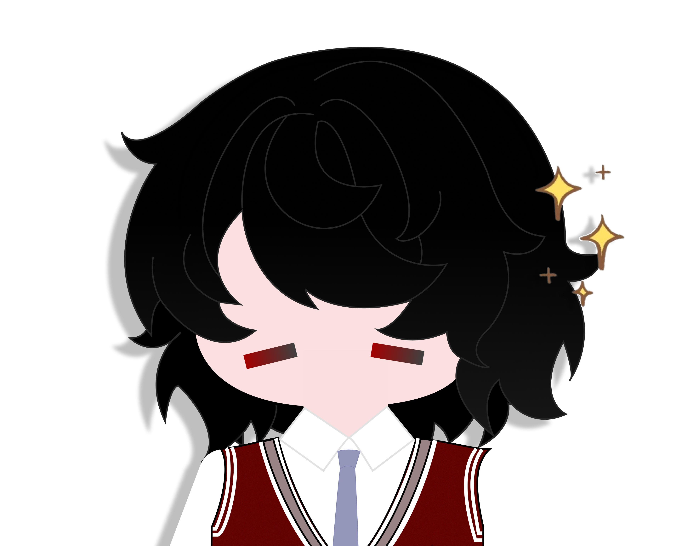

<!-- ================= TYPING HEADER (DI LUAR FRAME) ================= -->

  

 

<!-- ================= FRAME 1: SEARCH BAR + BIO & AVATAR ATAS ================= -->
<table border="0">
<tr>
<td width="75%" valign="top">

<!-- SEARCH BAR STYLE HEADER -->

Hi, I'm <b>Nisa'</b>, a Software Engineering student at <b>SMK Telkom Malang</b> who is passionate about technology, web development, and digital product design. I enjoy learning new things, building useful projects, and continuously improving my skills. Every project is an opportunity for me to grow, collaborate, and create solutions that make a positive impact.

</td>
<td width="25%" align="center" valign="middle">
<!-- AVATAR KARAKTER (FRAME ATAS KANAN) -->

</td>
</tr>
</table>

 

 

<!-- ================= FRAME 2: KARAKTER (KIRI) + INFORMASI (KANAN) ================= -->
<table border="0">
<tr>
<td width="35%" align="center" valign="middle">
<!-- KARAKTER FULL BODY (KIRI) -->

</td>

<td width="65%" valign="top">

<!-- INFORMASI LENGKAP & ANIMASI LUCU -->
<h3>

Information  🌸
</h3>

<ul>
<li>✨ <b>Full Name:</b> Khoirunnisa' Azzahro (Nisa')</li>
<li>🏫 <b>School:</b> SMK Telkom Malang — Software Engineering</li>
<li>🎨 <b>Passion:</b> Crafting Aesthetic UI/UX & Fullstack Apps</li>
<li>🚀 <b>Currently Learning:</b> Laravel, React, Next.js, & UI Design</li>
</ul>

 

<!-- MEDIA SECTION -->
<h3>

Find Me Online 🌐
</h3>

 &nbsp;
 &nbsp;

 

<!-- SKILL SECTION -->
<h3>

My Creative & Coding Skills 🛠️
</h3>

</td>
</tr>
</table>

 

 

<!-- ================= 3. SEKSI TAMBAHAN DI LUAR BORDER FRAME 2 ================= -->

<!-- 🎯 VISUAL STEP-BY-STEP LEARNING ROADMAP -->
<h3 align="center">🎯 Learning Roadmap & Skill Milestones</h3>

<table border="0">
<tr>
<td align="center" width="30%" valign="top">
<b>Phase 1: Completed 🟢</b>  
  
  

</td>
<td align="center" width="5%" valign="middle"><h1>➡️</h1></td>
<td align="center" width="32%" valign="top">
<b>Phase 2: Current Focus ⚡</b>  
  
  

</td>
<td align="center" width="5%" valign="middle"><h1>➡️</h1></td>
<td align="center" width="28%" valign="top">
<b>Phase 3: Next Target 🚀</b>  
  

</td>
</tr>
</table>

 

<!-- 📊 GITHUB STATS & STREAK COUNTER -->
<h3 align="center">📊 Activity Insights & Language Stats</h3>

  
  

  

 

<!-- 🐍 ANIMATED CONTRIBUTION SNAKE -->
<h3 align="center">🐍 Contribution Activity</h3>

  

 
